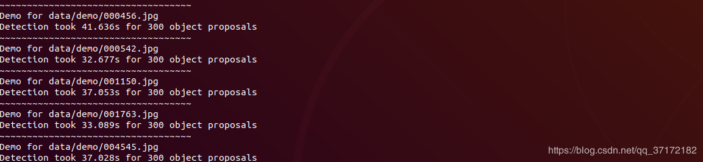
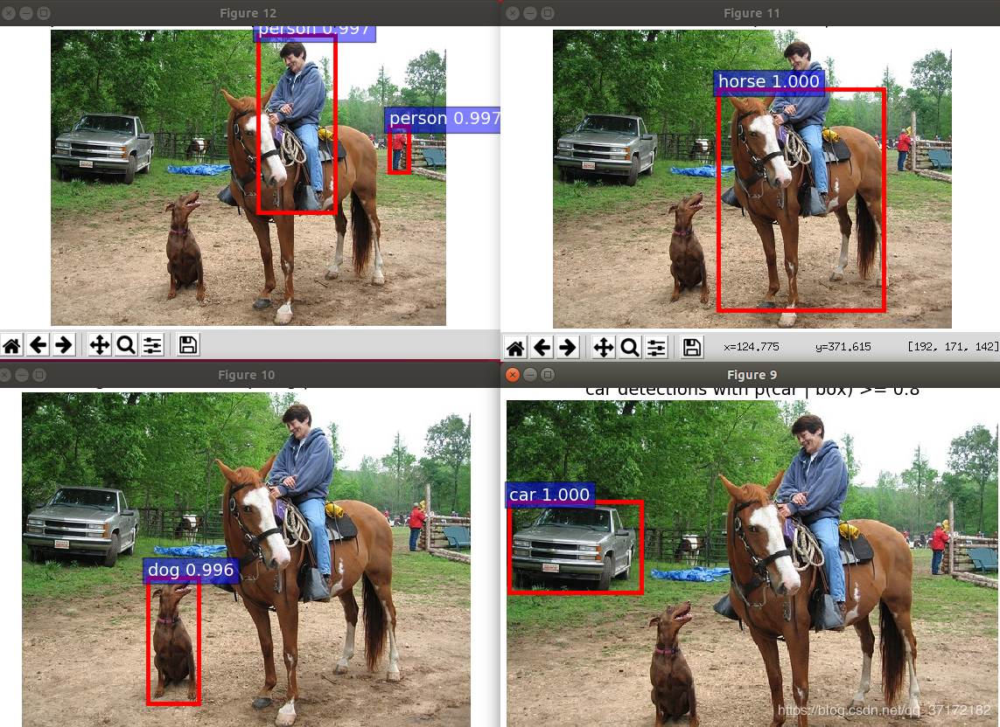
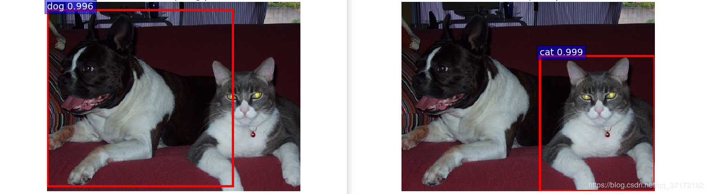
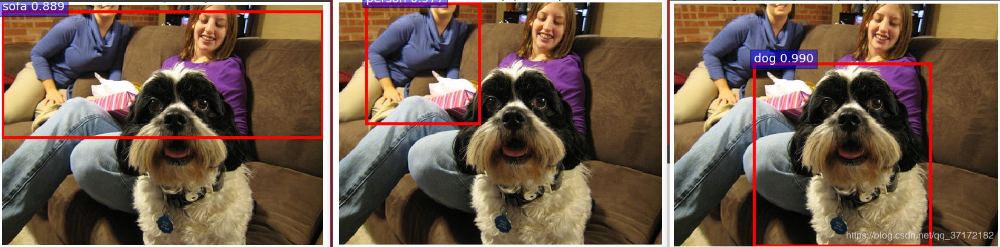
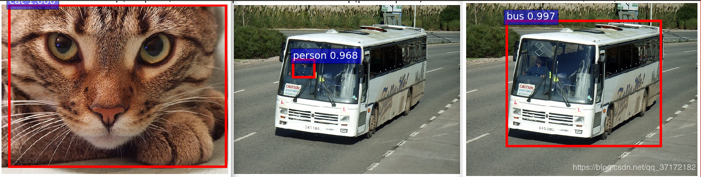

论文地址：[Faster R-CNN: Towards Real-Time Object Detection with Region Proposal Networks](https://arxiv.org/abs/1506.01497)

项目地址：[Faster_R-CNN_TensorFlow](https://github.com/GinkgoX/Faster_R-CNN_TensorFlow)

硬件平台：

Ubuntu 18.04（VMware）

Python 3.6

TensorFlow 1.x

原始代码链接：[tf-faster-rcnn](https://github.com/endernewton/tf-faster-rcnn)

参考博客：[目标检测之Faster R-CNN ---- TensorFlow（CPU）](https://blog.csdn.net/qq_37172182/article/details/100070889)

参数修改过程如下：

1、config.py文件修改：

2、nms_wrapper.py文件修改：（注释掉gpu_nms）

3、setup.py (注释掉GPU/CUDA部分)

4、进入lib/Makefile 执行

5、data目录下创建coco文件

```bash
cd data
git clone https://github.com/pdollar/coco.git
cd coco/PythonAPI
make
```

6、下载预训练模型 voc_0712_80k-110k.tgz [百度网盘下载](https://pan.baidu.com/s/1ClcNOWiqOm6nyAdfD3RSsQ) 提取码: 6dz8

7、运行demo.py：在data文件下运行：

```bash
python3 ../tools/demo.py
```

8、实验结果：



可以看到，没有GPU加速，识别速度至少在32s以上，识别效果见下图：









参考博客：

[Faster R-CNN tensorflow版本，cpu下运行demo](https://blog.csdn.net/sinat_33486980/article/details/81045315)

[如何运行Faster RCNN的tensorflow代码](https://www.cnblogs.com/toone/p/8433581.html)
